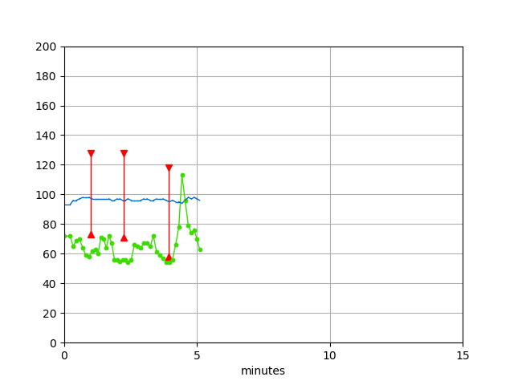

# Vital-signs


This project is an independent approach to acquire patient data from Philips patient monitors via network interface. It has no association with the Philips corporation.

An attempt was made to use Python Standard Library modules as much as possible.

**This application is not intended for diagnostic or therapeutic use.**


### Limitations


This project was developed and tested only using a MP70-type patient monitor. The communication protocol was reverse engineered using mainly packet sniffing and to some extent the (in my opinion) poorly written documentation of the manufacturer, that can be found on the internet. Not all data is parsed completely (as it should be done) and to some extent the communication is purely based on empiric packet sniffing. So there is a chance it might not work with certain patient monitors or firmware versions.
All in all, the code is still very raw and still contains many debugging functions that have only been commented out. If anyone wants to take the time to improve it, you are very welcome.
There are two flags in the init method that can be set to __True__ to make the module more verbose and to help narrow down problems.

Options for debugging:

* debug_info
* debug_error


Also refer to [somno/einstein](https://github.com/somno/einstein) here on github for more useful information on communication with Philips patient monitors.


### Important methodes of piv_data_source.py

#### piv_data_source.**init**(IP)
When creating a new insctance of piv_data_source the correct IP of the patient monitor is required as parameter.

#### piv_data_source.**start_client**()
Starts the UDP-client thread and begins to acquire data from the monitor.

#### piv_data_source.**start_watchdog**()
Starts the additional watchdog, that restarts the connection when exceptions occur. The connection-watchdog is automatically startet when starting the UDP-client. If you don't use the watchdog you will have to monitor the current connection yourself. This is necessary because the monitor sometimes terminates the connection spontaneously or does not process requests correctly.

#### piv_data_source.**halt_client**()
Terminates the connection, the UDP-client and the start_watchdog. Should be called before the object is deleted to terminate the connection correctly.

#### piv_data_source.**get_vital_signs**()
Returns a list with patient vital signs.

#### piv_data_source.**get_patient_data**()
Returns a list with patient information admission.

#### piv_data_source.**refresh_patient_data**()
Reads patient info admission information again to check for changes (usually it is only read once when a new connection is started).

#### piv_data_source.**check_client_is_working_correctly**()
Returns a boolean whether the connection is working properly.


### Using the Module PIV_data_source.py


A simple example how to use the __piv_data_source__ module. It starts a connection, reades some data and terminates the connection.


```python
from  piv_data_source import piv_data_source

# time module is just used to create some delay to give the monitor time to respond
import time 

# Insert the correct IP of the patient monitor here!
device = piv_data_source("127.0.0.1")

# Start client
device.start_client()

# delay 15 seconds to give the monitor time to respond
time.sleep(15)

# read patient information and vital signs
print(device.get_patient_data())
print(device.get_vital_signs())

# Terminate connection
device.halt_client()
```


### Plotting data


In the directory __plotting_example__ you can find a simple tool for plottig vital sign data for testing, using matplotlib.




Have fun!
